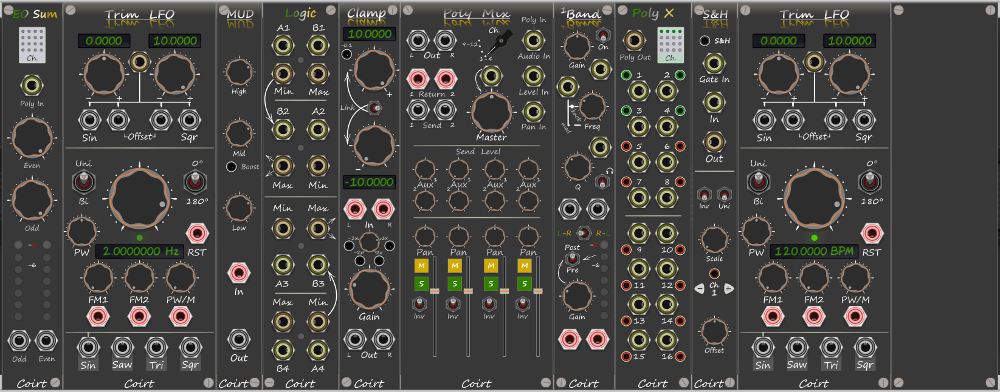

### V1.2.4

# Bark
VCVrack Modules

# Trim LFO v1.2.4
LFO module with two offset knobs which trims the top and bottom values from the LFO leaving the original waveform intact. Has the
extra function of mixing the diffent waveforms when the offsets are left full, but those can be trimmed also. If you click click on the
"RST" text under the RESET port it will manually reset the LFO. The result of this will also change the LFO's phase.

note: Two versions of the same module. A BPM value on the display and a Hz value on the display both are identical bar the display.

# SHTH v1.2.4
Polyphonic Sample and Hold and or Track and Hold. Control each connected channels params seperatly by increasing / decreasing channel 
number. Gate signal dictates the number of channels or there is a context menu item to override this, with override enabled the first 
gate channel sets the sample capture to each user set channel. Built in scale and offset for each channel, individual invert, polar 
pattern, sampling mode (S&H / T&H) and or the ability to sample internal or external sources per channel polyphonically.

# 1Band v1.2.4
Dual Mono Parametric EQ with built in VU peak meter to see if the signal is clipping. Pre/Post gain to VU meters (pre EQ / Post EQ). 
Listen to what frequencies are being processed by the EQ with the headphone switch. Swap L/R channels. Modulation Inputs for Gain,
Frquency and Q. 

# Poly Mix v1.2.4
Polyphonic Mono to Stereo Mixer with 2 Aux Bus mutes/solo for each channel, Sums channels to the output 4x4. Select which channels to
use with the Ch. knob i.e. 1-4 is polyphonic channels 1-4. 

# Clamp v1.2.4
Clamps an Audio or CV signal to the min/max positions on the knobs, signal will not go over the values set. Attenuverts the incoming
signal clamp is applied to the output. The buttons on the attenuverted signal can quickly snap to a position. Gain is applied before the
clamp, Note: hard clips the signal to the voltages set so it will start to distort the signal if the gain is set too high. 
can easily pad a 10v(0dB) to -0.1dB 

# Poly X v1.2.4
Just like VCV Merge except 4 channels are always on, when there is no input connected you can open the signal so a voltage is sent or
when off sends 0v. When there is an input connected you can mute the signal using the buttons or quick mute all by pressing the channel
lights area, passes the connected inputs to the poly out. Best use on Poly Mix as you need to send a 1v signal to a level if there is a 
level mod on another channel on the chain. For pan mute the signal 0v (centre pan - mute) for level unmute the signal (open). Context 
menu for increasing number of channels

# EO Sum v1.2.0
Sums polyphonic channels and distributes odd / even channel numbers.

# MUD v1.2.4
Low Mid High, simple Attenuating EQ, Invert button to get rid or add some Muddiness. Use on a parallel channel on Poly Mix (connect to 
AUX) can sound good for kick drums.

# Quad Logic v1.1.0
Because 1 just is not enough.

---------
Panel 7
15x7 panel for your rack with the custom grey bark colour

---------
# Social
Test builds can be viewed on my YouTube [Channel](https://www.youtube.com/channel/UCgXuIsOMqlTLbuXRaUjBWuA/featured?view_as=subscriber)

[Facebook](https://www.facebook.com/phil.golden.5070)

--------

You can find more information in the [Wiki](https://github.com/Coirt/Bark/wiki)

--------
 
If you would like contribute to development a donation would be very much appreciated, you can do so [here](https://www.paypal.me/philgolden)
