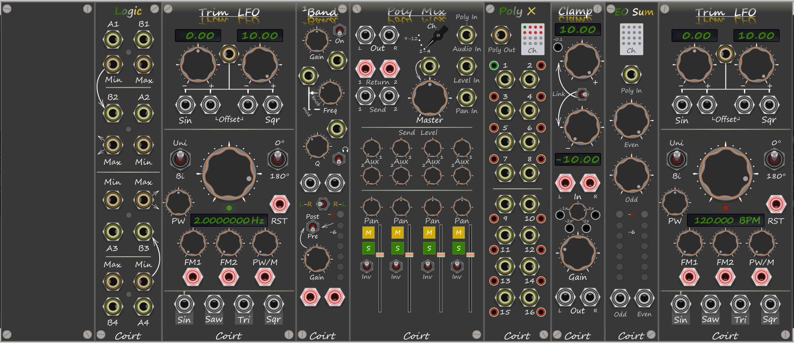

### V1.2.2 pre-release beta

# Bark
VCVrack Modules

# Trim LFO v1.2.0
LFO module with two offset knobs which trims the top and bottom values from the LFO leaving the original waveform intact. Has the
extra function of mixing the diffent waveforms when the offsets are left full, but those can be trimmed also. If you click click on the
"RST" text under the RESET port it will manually reset the LFO. The result of this will also change the LFO's phase.

note: Two versions of the same module. A BPM value on the display and a Hz value on the display both are identical bar the display.

# Quad Logic v1.1.0
Because 1 just is not enough.

# 1Band v1.1.0
Dual Mono Parametric EQ with built in VU peak meter to see if the signal is clipping. Pre/Post gain to VU meters (pre EQ / Post EQ). 
Listen to what frequencies are being processed by the EQ with the headphone switch. Swap L/R channels. Modulation Inputs for Gain,
Frquency and Q. 

# Poly Mix v1.1.0
Polyphonic Mono to Stereo Mixer with 2 Aux Bus mutes/solo for each channel, Sums channels to the output 4x4. Select which channels to
use with the Ch. knob i.e. 1-4 is polyphonic channels 1-4. 

# Clamp v1.1.0
Clamps an Audio or CV signal to the min/max positions on the knobs, signal will not go over the values set. Attenuverts the incoming
signal clamp is applied to the output. The buttons on the attenuverted signal can quickly snap to a position. Gain is applied before the
clamp, Note: hard clips the signal to the voltages set so it will start to distort the signal if the gain is set too high. 
can easily pad a 10v(0dB) to -0.1dB 

# Poly X v1.1.0
Just like VCV Merge except 16 channels are always on, when there is no input connected you can open the signal so a voltage is sent or
when off sends 0v. When there is an input connected you can mute the signal using the buttons or pass the connected input to the poly
out. Created to get around an issue with level/pan inputs on Poly Mix as you need to send a 1v signal to a previous level if there is a
level mod on a channel further in the chain. For pan mute the signal 0v (centre pan) for level unmute the signal (10v).

# EO Sum v1.2.0
Sums polyphonic channels and distributes odd / even channel numbers.

# Seq32
TBD

---------
Panel 7
15x7 panel for your rack with the custom grey bark colour

---------
# Social
Test builds can be viewed on my YouTube [Channel](https://www.youtube.com/channel/UCgXuIsOMqlTLbuXRaUjBWuA/featured?view_as=subscriber)

[Facebook](https://www.facebook.com/phil.golden.5070)

--------

You can find more information in the [Wiki](https://github.com/Coirt/Bark/wiki)

--------
 
If you would like contribute to development a donation would be very much appreciated, you can do so [here](https://www.paypal.me/philgolden)
